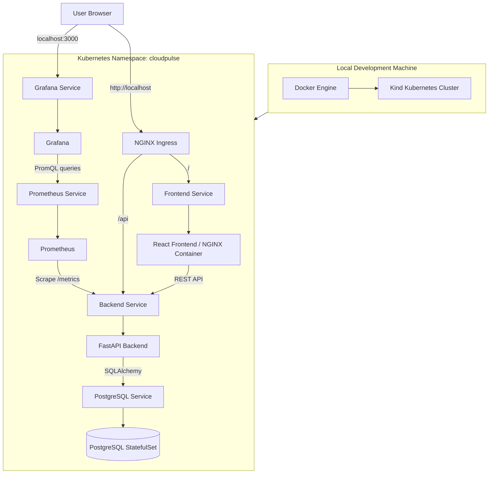
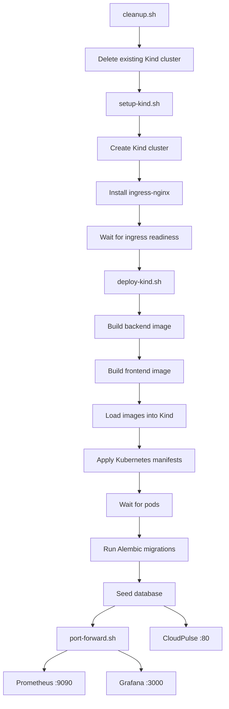
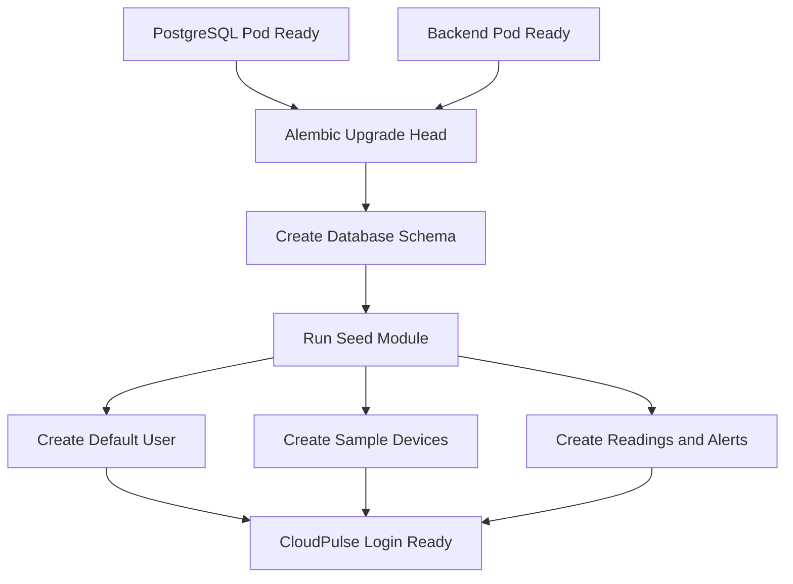
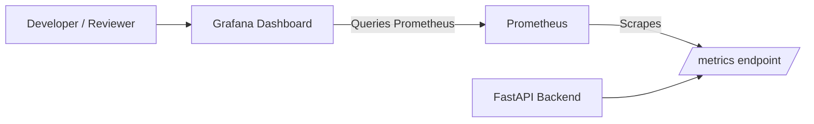
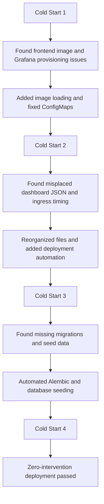

# CloudPulse

**CloudPulse** is a cloud-native IoT monitoring platform that simulates connected devices, stores telemetry data, exposes operational metrics, and visualizes system health through **Prometheus** and **Grafana**.

It is designed as a portfolio-ready full-stack project that demonstrates:

- **Frontend development** with React
- **Backend API development** with FastAPI
- **Database design and migrations** with PostgreSQL + Alembic
- **Containerization** with Docker
- **Kubernetes orchestration** with Kind
- **Observability** with Prometheus and Grafana
- **Deployment automation** with shell scripts

---

## Table of Contents

- [Project Overview](#project-overview)
- [Key Features](#key-features)
- [Architecture](#architecture)
- [System Screenshots](#system-screenshots)
- [Tech Stack](#tech-stack)
- [Repository Structure](#repository-structure)
- [Quick Start](#quick-start)
- [Deployment Scripts](#deployment-scripts)
- [Access URLs and Credentials](#access-urls-and-credentials)
- [Monitoring and Observability](#monitoring-and-observability)
- [Cold-Start Validation and Testing](#cold-start-validation-and-testing)
- [Why This Project Is Cloud-Native](#why-this-project-is-cloud-native)
- [Troubleshooting](#troubleshooting)
- [Future Improvements](#future-improvements)
- [Mermaid Diagram Sources](#mermaid-diagram-sources)
- [Author](#author)

---

## Project Overview

CloudPulse simulates an IoT monitoring workflow where devices continuously generate data such as temperature, humidity, and battery level. The application provides:

- A **web dashboard** for viewing devices, readings, alerts, and analytics
- A **FastAPI backend** for device and telemetry management
- A **PostgreSQL database** for persistent storage
- A **Prometheus metrics endpoint** for operational monitoring
- A **Grafana dashboard** for backend health and runtime visualization
- A **Kubernetes deployment** using Kind for local cloud-native testing

This project was refined through multiple **cold-start deployments**, with each failure used to improve automation, provisioning, and reliability.

---

## Key Features

### Application Features
- User login/authentication
- Device list and status monitoring
- Sensor readings dashboard
- Alert generation and display
- Analytics visualizations for telemetry trends
- Seeded demo data for quick evaluation

### Platform / DevOps Features
- Dockerized backend and frontend
- Kubernetes manifests for all services
- Ingress-based routing for the main application
- Automated database migrations with Alembic
- Automated seed data initialization
- Prometheus scraping of backend metrics
- Pre-provisioned Grafana data source and dashboard
- One-command deployment support through shell scripts

---

## Architecture

CloudPulse runs as a multi-service application inside a **Kind Kubernetes cluster** on a local development machine.

### High-Level Architecture Diagram


**Architecture summary:**
- The **user browser** accesses CloudPulse through **NGINX Ingress** at `http://localhost`
- The **frontend service** serves the React application through an NGINX container
- The **backend service** exposes a FastAPI REST API and a `/metrics` endpoint
- **PostgreSQL** stores devices, readings, users, and alerts
- **Prometheus** scrapes backend metrics
- **Grafana** queries Prometheus and displays observability dashboards

---

## System Screenshots

### Login Page


### Main Application Dashboard


### Prometheus Query Validation

The screenshot below shows the `up` query successfully returning the backend target.


### Grafana Monitoring Dashboard


### Successful Automated Deployment Output


---

## Tech Stack

### Frontend
- **React**
- **Vite**
- **NGINX** (for static frontend serving)

### Backend
- **FastAPI**
- **SQLAlchemy**
- **Pydantic**
- **Alembic**
- **Uvicorn**

### Database
- **PostgreSQL**

### Monitoring
- **Prometheus**
- **Grafana**

### Infrastructure / DevOps
- **Docker**
- **Kubernetes**
- **Kind**
- **NGINX Ingress Controller**
- **Bash scripting**

---

## Repository Structure

```text
.
├── backend/                     # FastAPI backend
│   ├── alembic/                 # Database migrations
│   ├── app/
│   │   ├── core/
│   │   ├── database/
│   │   ├── routers/
│   │   ├── schemas/
│   │   └── services/
│   ├── Dockerfile
│   ├── alembic.ini
│   └── requirements.txt
├── frontend/                    # React frontend
│   ├── src/
│   ├── public/
│   ├── Dockerfile
│   ├── nginx.conf
│   └── package.json
├── k8s/                         # Kubernetes manifests
│   ├── backend/
│   ├── frontend/
│   ├── postgres/
│   ├── monitoring/
│   │   ├── prometheus/
│   │   └── grafana/
│   ├── ingress/
│   ├── namespace.yaml
│   ├── configmap.yaml
│   └── secret.yaml
├── monitoring/
│   ├── prometheus/
│   └── grafana/
├── dashboards/
│   └── dashboard-export.json    # Exported Grafana dashboard JSON
├── scripts/
│   ├── cleanup.sh
│   ├── setup-kind.sh
│   ├── deploy-kind.sh
│   └── port-forward.sh
├── simulator/
│   └── sensor_simulator.py
├── docs/
│   ├── screenshots/
│   └── diagrams/
├── kind-config.yaml
├── docker-compose.yml
└── README.md
```

---

## Quick Start

### Prerequisites

Make sure the following are installed:

- Docker
- kubectl
- kind
- Bash shell
- Git

Optional but helpful:
- Node.js / npm
- Python 3.10+

### Recommended Deployment Flow

CloudPulse now supports a structured deployment flow using scripts.

1. **Clean up any existing cluster**
2. **Create a Kind cluster and install ingress**
3. **Deploy the full application stack**
4. **Start port forwarding for Prometheus and Grafana**

### Step 1 — Clean up old resources

```bash
./scripts/cleanup.sh
```

### Step 2 — Create the Kind cluster and install ingress

```bash
./scripts/setup-kind.sh
```

### Step 3 — Deploy CloudPulse

```bash
./scripts/deploy-kind.sh
```

### Step 4 — Start Prometheus and Grafana port forwarding

```bash
./scripts/port-forward.sh
```

> If you do not use `port-forward.sh`, Prometheus and Grafana can also be run with separate terminal sessions:
>
> ```bash
> kubectl port-forward svc/prometheus 9090:9090 -n cloudpulse
> kubectl port-forward svc/grafana 3000:3000 -n cloudpulse
> ```

---

## Deployment Scripts


### `cleanup.sh`
Deletes the existing Kind cluster and helps ensure a clean cold start.

### `setup-kind.sh`
Responsible for:
- Creating the Kind cluster
- Installing NGINX Ingress Controller
- Waiting for ingress readiness

### `deploy-kind.sh`
Responsible for:
- Building backend Docker image
- Building frontend Docker image
- Loading images into Kind
- Applying Kubernetes manifests
- Waiting for pods to become ready
- Running Alembic migrations
- Seeding the database
- Printing URLs and credentials

### `port-forward.sh`
Starts port forwarding for:
- Prometheus on `localhost:9090`
- Grafana on `localhost:3000`

---

## Access URLs and Credentials

### Application URLs

- **CloudPulse Frontend:** `http://localhost`
- **Prometheus:** `http://localhost:9090`
- **Grafana:** `http://localhost:3000`

### Default Local Demo Credentials

#### CloudPulse Login
- **Username:** `shreyas`
- **Password:** `Password123`

#### Grafana Login
- **Username:** `admin`
- **Password:** `admin123`

> These credentials are intended for **local development/demo only**.

---

## Monitoring and Observability

CloudPulse includes an observability stack that helps validate backend health and runtime behavior.

### Prometheus
Prometheus scrapes the backend `/metrics` endpoint and validates service health.

Example query used during validation:

```promql
up{instance="backend:8000", job="cloudpulse-backend"}
```

### Grafana
Grafana is provisioned with:
- A **Prometheus datasource**
- A **pre-configured CloudPulse monitoring dashboard**

The Grafana dashboard displays:
- Backend status
- Backend uptime
- Memory usage
- CPU usage
- Python GC activity
- Active scrape targets

### Monitoring Flow Diagram


---

## Cold-Start Validation and Testing

A major goal of this project was to move from a partially manual setup to a **repeatable, low-friction deployment**.

This was achieved through repeated cold-start testing.

### Cold-Start Improvement Summary


### What Was Improved Across Iterations

#### Cold Start 1
- Found frontend image loading issues
- Found Grafana provisioning/configuration issues
- Fixed ConfigMap setup and image handling

#### Cold Start 2
- Found misplaced dashboard JSON and ingress timing issues
- Reorganized files and improved deployment order
- Added better deployment automation

#### Cold Start 3
- Found missing database migrations and seed data
- Automated Alembic migrations and database seeding

#### Cold Start 4
- Achieved zero-intervention deployment success

### Final Result
The final deployment flow was successfully cold-started end-to-end, including:
- Cluster creation
- Ingress installation
- Application deployment
- Monitoring deployment
- Database schema initialization
- Demo data seeding
- Frontend login success
- Prometheus validation
- Grafana dashboard availability

---

## Why This Project Is Cloud-Native

Yes — CloudPulse follows several cloud-native principles.

### Cloud-native characteristics in this project
- **Containerized services** using Docker
- **Service decomposition** into frontend, backend, database, Prometheus, and Grafana
- **Kubernetes orchestration** with declarative manifests
- **Infrastructure automation** with scripts
- **Observability-first design** with Prometheus and Grafana
- **Stateless application containers** where appropriate
- **Configuration externalization** using ConfigMaps and Secrets
- **Repeatable deployments** validated through cold starts

While this project currently runs on **Kind locally**, the architecture is aligned with deployment to a real cloud-managed Kubernetes platform such as:
- Azure Kubernetes Service (AKS)
- Amazon EKS
- Google Kubernetes Engine (GKE)

---

## Troubleshooting

### 1. Frontend loads but login fails
Possible cause:
- Database migrations or seed data did not run

Fix:
- Ensure deployment script completed successfully
- Re-run migrations and seeding if necessary

```bash
kubectl exec -it deployment/backend -n cloudpulse -- alembic upgrade head
kubectl exec -it deployment/backend -n cloudpulse -- python -m app.database.seed
```

### 2. Grafana opens but dashboard has no data
Possible causes:
- Prometheus port forwarding not running
- Prometheus datasource not provisioned
- Dashboard provisioning misconfigured

Fix:
- Start/restart `./scripts/port-forward.sh`
- Verify Prometheus is reachable at `http://localhost:9090`
- Check Grafana provisioning ConfigMaps

### 3. Prometheus query fails
Possible cause:
- Backend target not being scraped

Fix:
- Open Prometheus and run:

```promql
up
```

Expected result should include:

```text
up{instance="backend:8000", job="cloudpulse-backend"} 1
```

### 4. Ingress creation fails during setup
Possible cause:
- Ingress controller admission webhook is not ready yet

Fix:
- Wait until ingress-nginx controller pod is fully ready before applying ingress resources
- Re-run deployment after readiness is confirmed

### 5. Port forwarding stops working
Possible cause:
- The terminal session was closed

Fix:
- Restart:

```bash
./scripts/port-forward.sh
```

Or run both commands manually in separate terminals.

---

## Future Improvements

- Deploy to **Azure AKS** or another managed Kubernetes platform
- Add CI/CD using **GitHub Actions**
- Add Helm charts for simplified deployment
- Add JWT/session hardening and role-based access control
- Persist Grafana state using volumes
- Add more backend metrics and application traces
- Add alert rules for Prometheus/Grafana
- Add cloud storage and secrets management integration
- Improve production readiness and scaling strategy

---

## Mermaid Diagram Sources

The PNG diagrams in `docs/diagrams/` can be backed by the following Mermaid source code.

### 1. Architecture Diagram



### 2. Deployment Workflow Diagram



### 3. Database Initialization Diagram



### 4. Monitoring Flow Diagram



### 5. Cold-Start Validation Diagram



---

## Author

**Shreyas Dhanvantari**  
Master's student in Electrical and Computer Engineering  
Ontario Tech University

If this project is being reviewed for internships, co-op, or entry-level software/cloud roles, it demonstrates practical experience in:
- Full-stack development
- Kubernetes deployment
- Monitoring and observability
- Debugging distributed systems
- Deployment automation
- Cold-start validation and reliability improvement

---

## Notes for GitHub Setup

To make the images work correctly on GitHub, place them in the following folders:

### Screenshots
```text
docs/screenshots/
├── cloudpulse-login.png
├── cloudpulse-dashboard.png
├── prometheus-up-query.png
├── grafana-dashboard.png
└── deployment-success.png
```

### Diagrams
```text
docs/diagrams/
├── architecture.png
├── deployment-flow.png
├── database-init-flow.png
├── monitoring-flow.png
└── cold-start-validation.png
```

Once those assets are committed in the same repository, this README will render correctly on GitHub.
